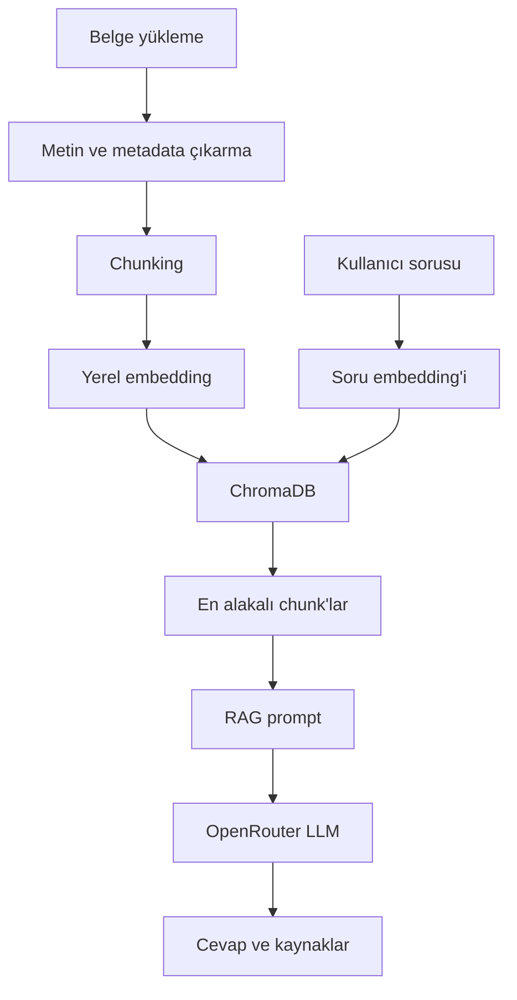

# Kurumsal Doküman Asistanı — RAG Proje Planı

> Kullanıcıların PDF, DOCX ve Markdown belgeleri yükleyerek bu belgeler hakkında doğal dilde sorular sorabildiği; cevaplarını ilgili belge parçalarına dayandıran ve kaynak gösteren bir RAG uygulaması.

## 1. Projenin amacı

Bu projenin amacı, şirket içi politikalar ve teknik yazılım dokümantasyonu üzerinde çalışan bir doküman asistanı geliştirmektir. Sistem:

- PDF, DOCX ve Markdown dosyalarını kabul eder.
- Belgelerden metin ve kaynak bilgilerini çıkarır.
- Metni anlamlı parçalara ayırır ve vektör veritabanında saklar.
- Kullanıcı sorusuyla en alakalı parçaları bulur.
- Yalnızca bulunan parçalara dayanarak cevap üretir.
- Cevapla birlikte dosya, sayfa veya bölüm kaynağını gösterir.
- Belgelerde cevap yoksa bunu açıkça belirtir.

## 2. Kapsam

### MVP kapsamında

- PDF, DOCX ve Markdown desteği
- Yerel embedding üretimi
- ChromaDB ile kalıcı vektör indeksi
- Semantic retrieval
- OpenRouter üzerinden LLM erişimi
- Kaynaklı RAG cevapları
- Streamlit kullanıcı arayüzü
- Küçük bir değerlendirme seti ve temel metrikler
- Temel hata yönetimi

### İlk sürümün dışında

- Kullanıcı hesabı ve yetkilendirme
- Çok kullanıcılı production altyapısı
- Fine-tuning
- Büyük ölçekli dağıtık vektör veritabanı
- Gelişmiş agent yapısı
- Sesli giriş/çıkış
- Her tür taranmış belge için kusursuz OCR

Bu özellikler ancak çalışan MVP tamamlandıktan sonra değerlendirilir.

## 3. Teknoloji kararları

| İhtiyaç | İlk tercih | Not |
|---|---|---|
| Geliştirme ortamı | VS Code | Ana proje `.py` dosyalarıyla geliştirilecek |
| Dil | Python | Sanal ortam `.venv` ile yönetilecek |
| Arayüz | Streamlit | Hızlı ve gösterilebilir MVP |
| Belge okuma | PyMuPDF, python-docx | Markdown standart Python ile okunabilir |
| Embedding | Yerel, çok dilli model | İlk aday: `google/embeddinggemma-300m` |
| Vektör veritabanı | ChromaDB | Yerel ve kalıcı saklama |
| LLM sağlayıcısı | OpenRouter | Model değiştirmeyi kolaylaştırır |
| Alternatif sağlayıcı | Groq | Hız testi veya yedek sağlayıcı |
| Sürüm takibi | Git | GitHub daha sonra private repository olarak eklenebilir |
| Yapılandırma | `.env` | API anahtarları koda yazılmayacak |

> Güvenlik notu: Gerçek şirket belgelerinden parçalar harici bir LLM API'sine gönderilmeden önce şirketin veri politikası ve yönetici onayı kontrol edilmelidir.

## 4. Sistem mimarisi



## 5. Uçtan uca çalışma akışı

1. Kullanıcı bir veya daha fazla belge yükler.
2. Sistem belge türünü doğrular ve metni çıkarır.
3. Dosya adı, sayfa ve bölüm gibi metadata korunur.
4. Metin, örtüşmeli ve anlamlı chunk'lara ayrılır.
5. Chunk embedding'leri yerel modelle üretilir.
6. Embedding, metin ve metadata ChromaDB'ye kaydedilir.
7. Kullanıcının sorusu embedding'e dönüştürülür.
8. En alakalı `top-k` chunk bulunur.
9. Soru ve numaralandırılmış kaynaklar RAG prompt'una yerleştirilir.
10. OpenRouter'daki sabit bir model cevap üretir.
11. Uygulama cevabı ve doğrulanabilir kaynak listesini gösterir.
12. Soru-cevap sonucu değerlendirme ve hata analizi için kaydedilebilir.

## 6. Önerilen klasör yapısı

```text
rag-document-assistant/
├── app.py
├── src/
│   ├── loaders.py
│   ├── chunking.py
│   ├── embeddings.py
│   ├── vector_store.py
│   ├── retrieval.py
│   ├── generation.py
│   ├── citations.py
│   └── rag_pipeline.py
├── data/
│   └── sample_documents/
├── chroma_db/
├── evaluation/
│   ├── test_questions.json
│   └── results/
├── tests/
├── .env.example
├── .gitignore
├── requirements.txt
└── README.md
```

## 7. Task tablosu

| ID | Task | Bağımlılık | Somut çıktı | Durum |
|---|---|---|---|---|
| T01 | Proje iskeleti ve ortam | — | Çalışan Python projesi | ✅ |
| T02 | Test belgeleri ve sorular | T01 | En az 10 soruluk başlangıç seti | ⬜ |
| T03 | Belge yükleme ve metin çıkarma | T01 | PDF, DOCX, MD okuyucu | ⬜ |
| T04 | Chunking ve metadata | T03 | Kaynağı korunan chunk listesi | ⬜ |
| T05 | Embedding ve ChromaDB | T04 | Kalıcı vektör indeksi | ⬜ |
| T06 | Retrieval testi | T02, T05 | Çalışan semantic search | ⬜ |
| T07 | OpenRouter entegrasyonu | T01 | API'den bağımsız cevap alma | ⬜ |
| T08 | RAG pipeline | T06, T07 | İlk çalışan RAG MVP | ⬜ |
| T09 | Citation sistemi | T08 | Doğrulanabilir kaynaklı cevap | ⬜ |
| T10 | Streamlit arayüzü | T09 | Kullanılabilir web uygulaması | ⬜ |
| T11 | Sistematik değerlendirme | T10 | Sayısal test sonuçları | ⬜ |
| T12 | Kalite iyileştirmeleri | T11 | Hata analizine dayalı geliştirme | ⬜ |
| T13 | Güvenlik ve hata yönetimi | T10 | Dayanıklı uygulama | ⬜ |
| T14 | README, rapor ve demo | T11–T13 | Teslim edilebilir proje | ⬜ |

Durum işaretleri: `⬜ Yapılmadı` · `🟨 Devam ediyor` · `✅ Tamamlandı` · `⛔ Bloke`

---

## 8. Detaylı task checklist

### T01 — Proje iskeleti ve geliştirme ortamı

#### Yapılacaklar

- [x] VS Code proje klasörünü oluştur.
- [x] Python `.venv` sanal ortamını oluştur ve etkinleştir.
- [x] `src`, `data`, `tests`, `evaluation` klasörlerini oluştur.
- [x] `requirements.txt` dosyasını hazırla.
- [x] `.env.example` oluştur.
- [x] `.gitignore` içine `.env`, `.venv/`, `__pycache__/`, `chroma_db/` ve gerçek belgeleri ekle.
- [x] Yerel Git repository'sini başlat.
- [x] Basit bir Python dosyasını çalıştırarak ortamı doğrula.

#### Kabul kriteri

Proje VS Code'da açılıyor, sanal ortam etkinleştirilebiliyor ve temel Python komutu hatasız çalışıyor.

#### Çıktı

Çalışmaya hazır, modüler ve sürüm takibi yapılabilen proje iskeleti.

---

### T02 — Test belgeleri ve başlangıç soru seti

#### Yapılacaklar

- [ ] En az bir PDF, bir DOCX ve bir Markdown test belgesi seç veya oluştur.
- [ ] Doğrudan cevaplanabilir sorular hazırla.
- [ ] Birden fazla parçayı gerektiren sorular ekle.
- [ ] Cevabı belgelerde olmayan sorular ekle.
- [ ] Beklenen cevap, dosya, sayfa/bölüm ve `answerable` bilgisini JSON'da sakla.
- [ ] Başlangıçta en az 10 test sorusu oluştur.

#### Örnek test kaydı

```json
{
  "question": "Uzaktan çalışma için kimden onay alınmalıdır?",
  "expected_answer": "Birim yöneticisinden",
  "expected_file": "uzaktan_calisma.pdf",
  "expected_page": 4,
  "answerable": true
}
```

#### Kabul kriteri

Sistemin retrieval ve cevap başarısını nesnel biçimde kontrol edebilecek en az 10 doğrulanmış soru bulunuyor.

---

### T03 — Belge yükleme ve metin çıkarma

#### Yapılacaklar

- [ ] PDF metnini PyMuPDF ile çıkar.
- [ ] DOCX paragraflarını ve mümkünse başlıklarını çıkar.
- [ ] Markdown metnini ve başlık yapısını oku.
- [ ] Dosya türünü ve uzantısını doğrula.
- [ ] Boş, bozuk veya desteklenmeyen dosyaları yakala.
- [ ] Dosya adı, sayfa/bölüm ve belge türü metadata'sını koru.

#### Örnek çıktı

```python
{
    "text": "...",
    "file_name": "izin_politikasi.pdf",
    "page_number": 4,
    "section": "Yıllık İzin",
    "document_type": "pdf"
}
```

#### Kabul kriteri

Üç dosya türünden okunabilir metin çıkarılıyor ve metnin kaynağı sonradan bulunabiliyor.

---

### T04 — Chunking ve metadata yönetimi

#### İlk ayarlar

- Chunk boyutu: yaklaşık 500–700 token
- Overlap: yaklaşık %10–20
- Bölme: mümkün olduğunca başlık, paragraf ve cümle sınırlarında

#### Yapılacaklar

- [ ] İlk chunking fonksiyonunu oluştur.
- [ ] Her chunk için benzersiz `chunk_id` üret.
- [ ] Kaynak metadata'sını her chunk'a aktar.
- [ ] Çok kısa ve anlamsız chunk'ları filtrele.
- [ ] Chunk boyutu ve overlap değerlerini yapılandırılabilir yap.
- [ ] Örnek belgede chunk sınırlarını elle incele.

#### Kabul kriteri

Belge anlamlı parçalara ayrılıyor; her chunk'ın hangi dosya ve sayfadan geldiği kaybolmuyor.

---

### T05 — Embedding ve ChromaDB

#### Yapılacaklar

- [ ] Çok dilli embedding modelini yükle.
- [ ] Chunk embedding'lerini üret.
- [ ] ChromaDB collection oluştur.
- [ ] Chunk metnini, embedding'i ve metadata'yı kaydet.
- [ ] Kalıcı depolamayı etkinleştir.
- [ ] Dosya hash'i ile aynı belgenin tekrar indekslenmesini engelle.
- [ ] Belgeyi indeksten silme altyapısına hazırlık yap.

#### Kabul kriteri

Belge bir kez indeksleniyor; uygulama kapatılıp açıldığında veritabanı ve kayıtlar korunuyor.

---

### T06 — Retrieval sistemi ve ilk kalite kontrolü

#### Yapılacaklar

- [ ] Sorunun embedding'ini üret.
- [ ] ChromaDB'den en alakalı `top-k` sonucu getir.
- [ ] İlk değer olarak `top_k=5` kullan.
- [ ] Sonuçlarda metin, dosya, sayfa ve benzerlik skorunu göster.
- [ ] T02 sorularında doğru kaynağın sırasını kontrol et.
- [ ] Basit Recall@5 hesabı ekle.

#### Kabul kriteri

Başlangıç test sorularının çoğunda doğru kaynak ilk 5 sonuç içinde bulunuyor.

#### Kilometre taşı

Bu task tamamlandığında çalışan bir semantic search sistemi vardır; henüz LLM gerekli değildir.

---

### T07 — OpenRouter API entegrasyonu

#### Yapılacaklar

- [ ] OpenRouter API anahtarını `.env` içine ekle.
- [ ] API'ye bağımsız bir test isteği gönder.
- [ ] Model ID'sini environment variable üzerinden ayarlanabilir yap.
- [ ] Geliştirme testlerinde belirli bir ücretsiz modeli sabitle.
- [ ] Timeout ve temel retry ekle.
- [ ] Kota, yetkilendirme ve model erişim hatalarını anlaşılır biçimde göster.

#### Örnek yapılandırma

```env
LLM_PROVIDER=openrouter
LLM_MODEL=secilen-model-id:free
OPENROUTER_API_KEY=your_key_here
```

#### Kabul kriteri

Python kodu seçilen modele istek gönderiyor ve geçerli yanıtı uygulamaya döndürüyor.

---

### T08 — Retrieval ve LLM'i birleştiren RAG pipeline

#### Yapılacaklar

- [ ] Kullanıcı sorusunu retrieval fonksiyonuna gönder.
- [ ] Bulunan chunk'ları numaralandır.
- [ ] Soru ve chunk'larla RAG prompt'u oluştur.
- [ ] Modele yalnızca verilen kaynaklara dayanmasını söyle.
- [ ] Bilgi bulunmuyorsa cevap vermemesini iste.
- [ ] Düşük `temperature` değeriyle tutarlı cevap üret.
- [ ] Pipeline'ı tek bir `answer_question()` fonksiyonunda birleştir.

#### Temel prompt kuralları

```text
- Yalnızca verilen kaynak parçalarını kullan.
- Kaynaklarda olmayan bilgi ekleme.
- Yeterli bilgi yoksa bunu açıkça belirt.
- Her önemli iddiayı kaynak numarasıyla ilişkilendir.
- Cevabı kullanıcının diliyle üret.
```

#### Kabul kriteri

Kullanıcı sorusu için ilgili chunk'lar bulunuyor ve LLM bu chunk'lara dayalı anlaşılır bir cevap üretiyor.

#### Kilometre taşı

İlk çalışan RAG MVP tamamlanmıştır.

---

### T09 — Citation sistemi

#### Yapılacaklar

- [ ] Prompt'taki kaynakları `[Kaynak 1]`, `[Kaynak 2]` şeklinde numaralandır.
- [ ] Kaynak numaralarını gerçek chunk metadata'sıyla eşleştir.
- [ ] Cevabın altında kullanılan kaynakları listele.
- [ ] Dosya ve sayfa/bölüm bilgisini göster.
- [ ] Modelin uydurduğu veya bulunmayan kaynak numaralarını filtrele.
- [ ] Kaynağın gerçekten cevabı desteklediğini test et.

#### Beklenen cevap biçimi

```text
Çalışanların yıllık izin süresi 14 gündür [Kaynak 1].

Kaynaklar:
- Kaynak 1: izin_politikasi.pdf, sayfa 4
```

#### Kabul kriteri

Gösterilen kaynaklar gerçekten cevabı destekliyor ve kullanıcı ilgili belge konumuna ulaşabiliyor.

---

### T10 — Streamlit kullanıcı arayüzü

#### Yapılacaklar

- [ ] Dosya yükleme alanı ekle.
- [ ] Desteklenen dosya türlerini göster.
- [ ] “Dokümanı işle” butonu ve işlem durumu ekle.
- [ ] İndekslenen belgeleri listele.
- [ ] Soru giriş alanı ekle.
- [ ] Cevabı okunabilir biçimde göster.
- [ ] Kaynakları açılır bölümlerde göster.
- [ ] Yükleme, indeksleme ve API hatalarını kullanıcıya açıkla.

#### Kabul kriteri

Teknik bilgisi olmayan bir kullanıcı belge yükleyebiliyor, indeksleyebiliyor, soru sorabiliyor ve kaynaklı cevabı görebiliyor.

---

### T11 — Sistematik değerlendirme

#### Yapılacaklar

- [ ] Test setini 20–30 soruya çıkar.
- [ ] Tek chunk ile cevaplanan sorular ekle.
- [ ] Birden fazla chunk gerektiren sorular ekle.
- [ ] Benzer kavramları ayırt eden sorular ekle.
- [ ] Türkçe soru–İngilizce belge örnekleri ekle.
- [ ] Cevabı olmayan sorular ekle.
- [ ] Her testte kullanılan model, ayarlar ve süreyi kaydet.

#### Temel metrikler

| Metrik | Açıklama |
|---|---|
| Recall@5 | Doğru kaynak ilk 5 retrieval sonucu içinde mi? |
| Answer accuracy | Üretilen cevap beklenen bilgiyle uyumlu mu? |
| Citation accuracy | Gösterilen kaynak cevabı gerçekten destekliyor mu? |
| Rejection accuracy | Cevapsız soruda sistem doğru biçimde reddediyor mu? |
| Latency | Uçtan uca cevap süresi kaç saniye? |

#### Kabul kriteri

Sistemin güçlü ve zayıf yönleri yalnızca yorumla değil, test sonuçları ve örnek hatalarla gösterilebiliyor.

---

### T12 — Hata analizine dayalı kalite iyileştirmeleri

#### Karar sırası

```text
Doğru kaynak bulunamıyorsa → chunking / embedding / retrieval
Kaynak doğru, cevap kötüyse → prompt / LLM
Kaynak etiketi yanlışsa → citation eşlemesi
Belgelerde cevap yokken sallıyorsa → eşik / prompt / rejection kontrolü
```

#### İhtiyaca göre seçilecek geliştirmeler

- [ ] Chunk boyutu ve overlap karşılaştırması
- [ ] `top-k` karşılaştırması
- [ ] Farklı embedding modeli karşılaştırması
- [ ] Başlık/section tabanlı chunking
- [ ] Metadata filtreleme
- [ ] Hybrid search
- [ ] Reranker
- [ ] OCR desteği
- [ ] Tablo çıkarma iyileştirmesi
- [ ] OpenRouter modellerinin aynı test setinde karşılaştırılması
- [ ] Groq veya yerel modelle sağlayıcı karşılaştırması

#### Kabul kriteri

Eklenen her geliştirme, belirli bir hata grubunu hedefliyor ve önce/sonra sonuçlarıyla faydası gösteriliyor.

---

### T13 — Güvenlik, gizlilik ve hata yönetimi

#### Yapılacaklar

- [ ] API anahtarlarının repository'de olmadığını kontrol et.
- [ ] Gerçek şirket belgelerinin Git'e eklenmesini engelle.
- [ ] Desteklenmeyen ve bozuk dosyaları güvenli biçimde reddet.
- [ ] Dosya boyutu ve mümkünse sayfa sınırı koy.
- [ ] API timeout, rate limit ve kota hatalarını yönet.
- [ ] Geçici dosyaları kontrollü kullan.
- [ ] Aynı dosyanın tekrar indekslenmesini engelle.
- [ ] İndekslenmiş belgeyi silme işlevi ekle.
- [ ] Harici API'ye gönderilen içeriği minimum gerekli chunk'larla sınırla.
- [ ] Kurumsal veri kullanım iznini doğrula.

#### Kabul kriteri

Uygulama beklenen hatalarda çökmüyor, gizli bilgileri koda veya repository'ye yazmıyor ve kullanıcıya anlaşılır hata mesajı veriyor.

---

### T14 — Dokümantasyon, rapor ve demo

#### README içeriği

- [ ] Projenin amacı ve kapsamı
- [ ] Mimari ve veri akışı
- [ ] Kurulum adımları
- [ ] Ortam değişkenleri
- [ ] Çalıştırma komutu
- [ ] Kullanılan modeller ve seçim gerekçeleri
- [ ] Test yöntemi ve sonuçları
- [ ] Bilinen sınırlamalar
- [ ] Gelecek geliştirmeler

#### Demo senaryosu

1. Bir test belgesi yükle.
2. Belgedeki açık bir bilgiyi sor.
3. Kaynaklı cevabı göster.
4. Birden fazla parçayı gerektiren soru sor.
5. Belgede bulunmayan bir şey sor.
6. Sistemin bilgi uydurmak yerine reddettiğini göster.
7. İstenirse iki modelin sonuçlarını kısaca karşılaştır.

#### Kabul kriteri

Başka biri README üzerinden projeyi kurabiliyor; proje 5–10 dakikalık demoda uçtan uca ve ölçülebilir biçimde gösterilebiliyor.

## 9. Kilometre taşları

| Kilometre taşı | İlgili task | Sonuç |
|---|---|---|
| M1 — Doküman okuyucu | T03 | Üç dosya türünden metin ve metadata çıkarılır |
| M2 — Semantic search | T06 | Soruyla alakalı belge parçaları bulunur |
| M3 — RAG MVP | T08 | Kaynağa dayalı cevap üretilebilir |
| M4 — Kullanılabilir uygulama | T10 | Web arayüzünden uçtan uca kullanım mümkündür |
| M5 — Ölçülmüş sistem | T11 | Başarı ve hatalar sayısal olarak gösterilir |
| M6 — Teslim | T14 | Kod, dokümantasyon ve demo hazırdır |

## 10. Model karşılaştırma planı

Model karşılaştırılırken retrieval sonuçları, prompt, soru ve ayarlar sabit tutulmalıdır. Yalnızca LLM değiştirilmelidir.

| Kriter | Sorulacak soru |
|---|---|
| Doğruluk | Beklenen bilgiyi doğru aktarıyor mu? |
| Groundedness | Yalnızca verilen kaynaklara mı dayanıyor? |
| Türkçe kalitesi | Cevap açık, doğal ve doğru mu? |
| Citation uyumu | İddialar doğru kaynaklarla eşleşiyor mu? |
| Rejection | Bilgi yoksa cevap uyduruyor mu? |
| Gecikme | Cevap süresi kabul edilebilir mi? |
| Erişilebilirlik | Ücretsiz model düzenli biçimde erişilebilir mi? |

Geliştirme sırasında `openrouter/free` yönlendiricisi yerine belirli bir ücretsiz model ID'si sabitlenmelidir. Aksi hâlde farklı isteklerin farklı modellerce cevaplanması deney sonuçlarını bozar.

## 11. Riskler ve önlemler

| Risk | Etki | Önlem |
|---|---|---|
| PDF metni bozuk çıkar | Retrieval başarısı düşer | Dosya bazlı kontrol, gerekirse OCR |
| Chunk'lar anlamsız bölünür | Doğru bilgi bulunamaz | Başlık/paragraf tabanlı bölme ve test |
| Ücretsiz model erişilemez | Uygulama cevap veremez | Modeli ayardan değiştir, retry ve fallback |
| Model kaynak dışı bilgi üretir | Güvenilirlik düşer | Sıkı prompt, düşük temperature, rejection testi |
| Citation uydurulur | Yanlış güven oluşur | Kaynakları metadata üzerinden programatik eşleştir |
| Şirket verisi dış API'ye gider | Gizlilik sorunu | Önceden izin, test belgeleri, minimum chunk gönderimi |
| Kapsam büyür | MVP gecikir | Önce T01–T10, ileri özellikler yalnızca test gerekçesiyle |

## 12. Çalışma kuralları

1. Tasklar bağımlılık sırasına göre tamamlanır.
2. Bir task kabul kriterini karşılamadan tamamlandı sayılmaz.
3. Her task sonunda küçük bir test veya görünür çıktı alınır.
4. Büyük geliştirmelerden önce çalışan sürüm Git commit'i olarak kaydedilir.
5. Kalite iyileştirmeleri tahminle değil, hata analiziyle seçilir.
6. Model, chunk ayarı ve test sonucu gibi kararlar aşağıdaki karar günlüğüne eklenir.

## 13. Karar günlüğü

| Tarih | Karar | Gerekçe | Sonuç/Not |
|---|---|---|---|
| 2026-08-10 | Ana geliştirme ortamı VS Code | Modüler Python projesi, debug ve Git desteği | Başlangıç kararı |
| 2026-08-10 | Ana LLM erişimi OpenRouter | Model esnekliği ve ücretsiz seçenekler | Model ID testlerden sonra sabitlenecek |
| 2026-08-10 | Embedding ve ChromaDB yerel | Gizlilik, maliyet ve kolay geliştirme | İlk MVP yaklaşımı |
| 2026-08-10 | İlerleme hafta yerine task bazlı | Her aşamada somut ve test edilebilir çıktı | Bu doküman ana takip dosyasıdır |

## 14. Aktif çalışma alanı

### Şu anki task

`T01 — Proje iskeleti ve geliştirme ortamı`

### Sonraki tek adım

VS Code'da `rag-document-assistant` klasörünü oluşturmak ve Python sanal ortamını hazırlamak.

### Blokajlar / sorular

- [ ] Şirket içi belgelerin harici LLM API'sine gönderilmesine izin var mı?
- [ ] İlk sabit OpenRouter modeli hangisi olacak?
- [ ] İlk test belgeleri gerçek olmayan örnek belgeler mi olacak?

---

## Güncelleme notu

Bu dosya yaşayan proje planıdır. Bir task tamamlandığında:

1. Task tablosundaki durum `✅` yapılır.
2. İlgili checklist maddeleri işaretlenir.
3. Test sonucu veya önemli karar karar günlüğüne yazılır.
4. “Aktif çalışma alanı” bir sonraki taska geçirilir.

